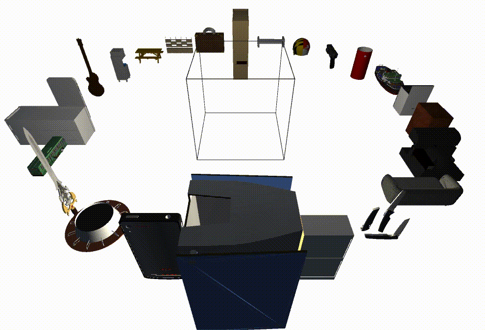

**PackIt: A Virtual Environment for Geometric Planning**
[Ankit Goyal](http://imankgoyal.github.io), [Jia Deng](https://www.cs.princeton.edu/~jiadeng/)  
*International Conference on Machine Learning (ICML), 2020*
```
@inproceedings{goyal2020packit,
  title={PackIt: A Virtual Environment for Geometric Planning},
  author={Goyal, Ankit and Deng, Jia},
  booktitle={International Conference on Machine Learning},
  year={2020},
}
```

## Getting Started

First clone the repository. We would refer to the directory containing the code as `<packit_dir>`.

```
git clone git@github.com:princeton-vl/PackIt.git
```

#### Requirements
The PackIt environment is build using [Unity ML-agents](https://github.com/Unity-Technologies/ml-agents/tree/0.4.0) version **0.4.0**. 
To train the neural network model, we recommend using a machine with GPU. 
The code is tested on Linux OS with Python version **3.5**, CUDA version **8.0**, and cuDNN version **5.1**.
We provide standlone [Unity builds for Linux x86_64 platform](https://docs.unity3d.com/2017.4/Documentation/Manual/BuildSettingsStandalone.html).
For visualization, we also provide a Unity build for Mac OS.

#### Install Libraries
We recommend to first install [Anaconda](https://anaconda.org/) and create a virtual environment.
```
conda create --name packit python=3.5
```

Activate the virtual environment and install the libraries. Make sure you are in `<packit_dir>`.
```
conda activate packit
pip install -r requirements.txt
```

#### Download Datasets and Pre-trained Models
Make sure you are in `<packit_dir>`. `download.sh` script downloads all the data, unzips them, and places them at correct locations. Note that symbolic links are created between the `data` folder and appropriate locations inside the unity data directory. This is necessary so that the data is accessible from the build unity game.
```
chmod +x download.sh
./download.sh
```

## Code Organization
- `<packit_dir>/main.py`: Python script for training and evaluating learning based-models on PackIt and PackIt-Easy. 

- `<packit_dir>/main_heuristic.py`: Python script for training and evaluating heuritic-based models on PackIt and PackIt-Easy. 

- `<packit_dir>/stable-baselines`: Adapted from [stable-baselines](https://github.com/hill-a/stable-baselines) with some modification. We use it for our PPO baselines. 

- `<packit_dir>/unity`: Adapted from [Unity ML-agents](https://github.com/Unity-Technologies/ml-agents/tree/0.4.0) with minor modification. It is required to run the PackIt environment. It communicates with the game built using Unity using sockets and provides a python interface for interacting with the environment.

- `<packit_dir>/packing`: Contains code for creating and evaluating OpenAI gym compatible PackIt environment as well as various baselines.

- `<packit_dir>/log`: Created after `download.sh` is run. Stores the pretrained learning-based models according to the naming convention [here](https://github.com/princeton-vl/PackIt/blob/master/main.py#L81).  

- `<packit_dir>/unity/envs`: Created after `download.sh` is run. Stores the unity game build. `<packit_dir>/unity/envs/packit.x86_64` is game build for the main unity environment while `<packit_dir>/unity/envs/packit.x86_64` is the game build for the visualization environment.

- `<packit_dir>/data`: Created after `download.sh` is executed. Contains information about the shapes and packs. This folder is symbolically linked to `<packit_dir>/unity/envs/packit_Data/StreamingAssets` and `<packit_dir>/unity/envs/packit_viz_Data/StreamingAssets` so that it can be accessed by the unity game build. More information about StreamingAssets in Unity can be found [here](https://docs.unity3d.com/2017.4/Documentation/Manual/StreamingAssets.html).

- `<packit_dir>/data/data_<tr/va/te>`: Contains the shapenet shapes as [asset bundles](https://docs.unity3d.com/Manual/AssetBundlesIntro.html). This helps in faster loading for data.

- `<packit_dir>/data/pack_<ab/te/tr/va>`: Contains information about packs in json format. Each file (like `<packit_dir>/data/pack_tr/0_tr`) can have information about multiple packs. We refer to the order of the pack inside this file as its `id`. On average, each file has information about 5 packs.

- `<packit_dir>/data/pack_<ab/te/tr/va>_precompute_<python/unity>`: Contains information about packs so that they can be loaded faster. We precompute things like voxel representation of shapes and store here.

- `<packit_dir>/data/visualize`: Contains some saved actions for different baselines. These can be used during visualization. For more information refer to the visualization section.

- `<packit_dir>/results`: Created after `download.sh` is executed. It contains the reward of various agents. Once an agent is evaluated, a pickle file with rewards is saved here based on the naming [here](https://github.com/princeton-vl/PackIt/blob/master/main.py#L186) and [here](https://github.com/princeton-vl/PackIt/blob/master/main_heuristic.py#L105). We also provide precomputed rewards for our agents. Change [this](https://github.com/princeton-vl/PackIt/blob/master/results.py#L24) line to the result you want to see and run `python results.py`.
 
## Testing
To debug whether everything is set up correctly, use the `test_packing_env.ipynb` jupyter notebook. It runs a packing environment with ground-truth actions.  Make sure you have downloaded everything properly before this step. Note that the plotting of voxels in matplotlib is slow. 


## Running Experiments
To run any experiment, refer to the `command` dictionary inside `commands.py`. For example to run heuristic-based baseline same as row 1 in table 1 of the paper use the command `python main_heuristic.py --eval_va_or_te 0 --pol_1 sha_rand`. For some experiments, like `tab_3_row_2_3`, the dictionary contains a list of commands. Essentially, we break the evaluation into multiple commands so that they can be run in parallel. Depending on the computing infrastructure, these commands can be run in parallel or serial.


## Visualization
Make sure you have downloded everything before this step. Follow the steps below:

1. Save the actions. Follow the python script `<packit_dir>/visualize.py`. It saves the agents actions in a json file. We also provide some prerecorded actions in `<packit_dir>/data/visualize`
1. Run the unity visulization build like this `./<packit_dir>/unity/evns/packit_viz.x86_64 -getSavedAct true -fileName pack_va/0_va -packID 1 -actFileName visualize/pack_va_0_va_1_gt`. This would run visualization for the pack inside `pack_va/0_va` with ID `1` using the groundtruth actions. When the unity build opens up, press `a` to execute the actions. Only for visualization, we also provide a Mac OS unity build which could be used for visualization on Mac OS. The Mac OS visualizer could be run as `./<packit_dir>/unity/evns/packit_viz_mac.app/Contents/MacOS/EgpGame3 -getSavedAct true -fileName pack_va/0_va -packID 1 -actFileName visualize/pack_va_0_va_1_gt`.


## Notes
- We train our learning-based model with 8 parallel environments. We recommend using a system with at least 8 CUPs to do the same with 4 GB of RAM each.

- Unity environment communicated with the python process using ports. The `--id-start` flag inside `main.py` and `main_heuristic.py` could be used to start a process with different port id. The code will crash in case multiple unity environments are using the same port. This is the reason why we give different `--id-start` for different commands while running multiple environments in parallel. `--id-start 0` corresponds to port `5005` on OS (as defined [here](https://github.com/princeton-vl/PackIt/blob/master/unity/unityagents/environment.py#L33)). Any increment in `--id-start` updates the port incrementally. For example, `--id-start 10` corresponds to port `5015`.

- `--eval_start_id` and `--eval_end_id` flags inside `main.py` and `main_heuristic.py` are used to specify the id of the packing files which we want to evaluate. While running multiple parallel environments of evaluation, we can use these flags to specify the id of packing files on which we want to evaluate. 

- When the unity environnment is running, you might get a terminal log similar to the following. It is expected and the environment would still run fine. 
```
ALSA lib confmisc.c:767:(parse_card) cannot find card '0'
ALSA lib conf.c:4568:(_snd_config_evaluate) function snd_func_card_driver returned error: Permission denied
ALSA lib confmisc.c:392:(snd_func_concat) error evaluating strings
ALSA lib conf.c:4568:(_snd_config_evaluate) function snd_func_concat returned error: Permission denied
ALSA lib confmisc.c:1246:(snd_func_refer) error evaluating name
ALSA lib conf.c:4568:(_snd_config_evaluate) function snd_func_refer returned error: Permission denied
ALSA lib conf.c:5047:(snd_config_expand) Evaluate error: Permission denied
ALSA lib pcm.c:2565:(snd_pcm_open_noupdate) Unknown PCM default
```

- Apart from the stdout, unity log is written in `<packit_dir>/log/unity/<port>`, which might be useful for debugging.

- For generating more data or making your own unity build refer to [this repository.](https://github.com/princeton-vl/PackIt-Extra).

## Acknowledgment
This repository uses code from [ML-Agents](https://github.com/Unity-Technologies/ml-agents/tree/0.4.0) and [stable-baselines](https://github.com/hill-a/stable-baselines).
